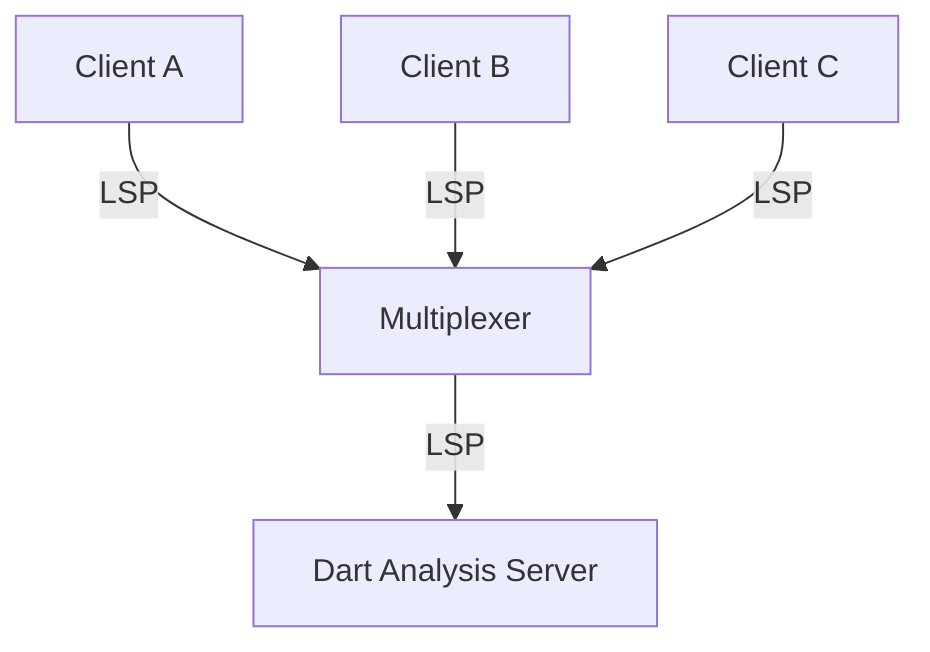

# Design Doc: Shared Analysis Server Multiplexer

## Status
Draft

## Objective
To reduce resource consumption (CPU, Memory) by sharing a single instance of the Dart Analysis Server across multiple clients (e.g., IDE instances, build tools, command-line utilities).

## Background
Currently, each client typically spawns its own instance of the Dart Analysis Server. When having multiple IDE windows open to the same projects, or an MCP server and an IDE open to the same projects, this leads to significant duplication of work:
- Re-parsing the same SDK and package files.
- Maintaining separate caches and indexes.
- High memory usage.

By multiplexing client connections to a single analysis server, we can share these costs.

## Architecture

A wrapper script or process (the **Multiplexer**) acts as a proxy between N clients and 1 Analysis Server instance.

### Communication Protocol
The Multiplexer communicates with clients and the server using the Language Server Protocol (LSP).

## Discovery and Connection

To enable seamless integration, clients need a way to discover if a multiplexer is already running and connect to it.

### The Discovery File
- **Location**: A file in the platform-specific config directory (e.g., `~/.config/` on Linux), in a subdirectory called `dart-language-server`.
- **Name**: A fixed name (e.g., `analysis_server_multiplexer.lock`).
- **Locking**: The active Multiplexer process will hold an exclusive write lock on this file for its entire lifetime. This should follow the pattern in `pkg/dart_data_home/lib/src/pid_files.dart` (keeping the file open, and using advisory locks on POSIX systems).
- **Content**: The file will contain connection information (e.g., a port number or Unix domain socket path) that clients can use to connect to the Multiplexer.

### Client Connection Flow (`dart language-server`)
The `dart language-server` command will be updated to act as a thin client/proxy to the Multiplexer:
1.  **Check for Active Multiplexer**: When `dart language-server` starts, it attempts to acquire a write lock on the discovery file.
2.  **Multiplexer Exists**: If the lock attempt fails, it means a Multiplexer is already running.
    - The command reads the connection info from the file.
    - It connects to the Multiplexer (e.g., via socket).
    - It proxies standard I/O from the IDE to the Multiplexer connection.
3.  **Multiplexer Does Not Exist**: If the lock attempt succeeds, no Multiplexer is running.
    - The command spawns the Multiplexer as a **detached process**.
    - The detached Multiplexer process will:
        - Acquire the lock on the discovery file.
        - Write its connection info to the file.
        - Spawn the actual Dart Analysis Server.
        - Start listening for client connections.
    - The `dart language-server` command (now acting as a client) waits briefly for the file to be written, reads the connection info, and connects to the new Multiplexer.

## Key Challenges & Proposed Solutions

### 1. Workspace Management

**Challenge**: Different clients will have different workspace folders open. The Analysis Server needs to know about all of them, but only analyze what is needed.

**Proposed Solution**:
- The Multiplexer maintains a reference count of clients interested in each workspace folder.
- When a client connects and sends `initialize`, the Multiplexer adds its workspace folders to the tracked set.
- The Multiplexer sends `workspace/didChangeWorkspaceFolders` to the Analysis Server to add new folders.
- When a client disconnects or explicitly removes a folder, the reference count is decremented.
- If the reference count for a folder drops to zero, the Multiplexer can send a `didChangeWorkspaceFolders` to remove it from the server, or keep it for a configurable timeout period to avoid re-analysis if another client opens it soon.

### 2. Capability Negotiation

**Challenge**: Clients have different capabilities (e.g., support for dynamic registration, specific completion items, code actions). The Analysis Server is initialized only once, but must serve all clients.

**Proposed Solution**:
- **Server Initialization**: The Multiplexer initializes the Analysis Server with a "super-set" of capabilities that covers the maximum expected capabilities of all clients.
- **Client Initialization**: When a client sends `initialize`, the Multiplexer intercepts the request. It returns an `initialize` response tailored to that specific client, based on the intersection of:
    1. What the client requested.
    2. What the Multiplexer supports proxying/emulating.
    3. What the Analysis Server actually supports.

#### Capability Handling Strategies

When dealing with clients of varying capabilities, the Multiplexer has a few options:

1.  **Intersection (Conservative)**: Only enable capabilities supported by *all* currently connected clients. If a new client connects with lower capabilities, the Multiplexer might need to dynamically unregister capabilities (if supported) or downgrade the experience for all. This is the safest but least feature-rich approach.
2.  **Union with Translation (Complex)**: The Multiplexer exposes the union of all capabilities to the server. For clients, it exposes what they support.
    *   If Client A supports `textDocument/formatting` and Client B does not, the Multiplexer routes formatting requests from Client A to the server, but never expects them from Client B.
    *   If the server sends a notification that only Client A supports, the Multiplexer only sends it to Client A.
3.  **Dynamic Capabilities (Implemented)**: We use a custom protocol extension `server/registerCapability` (sent from Multiplexer to Server). When a new client connects with capabilities not yet supported by the server, the Multiplexer dynamically registers these capabilities with the server. This allows the server to lazily enable features as needed by connected clients.

### 3. Diagnostics and Notifications

**Challenge**: Notifications from the server (like `textDocument/publishDiagnostics`) need to be routed to the correct clients.

**Proposed Solution**:
- The Multiplexer must track which clients have which files open (via `textDocument/didOpen` and `textDocument/didClose`).
- When the server sends `textDocument/publishDiagnostics` for a file, the Multiplexer routes it only to clients that are currently interested in that file or its enclosing workspace folder.
- **Progress and Status Translation**: The server sends `$/progress` notifications if the client supports `workDoneProgress`, and falls back to `$/analyzerStatus` otherwise. If the Multiplexer receives `$/progress` for analysis (token `'ANALYZING'`), it synthesizes `$/analyzerStatus` notifications for clients that do not support `workDoneProgress` to ensure they don't hang waiting for analysis completion.

### 4. Lifecycle Management

**Challenge**: When does the server start and stop?

**Proposed Solution**:
- **Start**: The server starts when the first client connects to the Multiplexer.
- **Stop**: The server stops after the last client disconnects, potentially after a timeout to handle quick restarts.

## Alternatives Considered

### A. Client-side connection sharing
Have clients coordinate to share a port. This is hard to implement across different editors and tools.

### B. Modifying the Analysis Server directly to support multi-tenancy
This would be the most efficient solution but requires significant changes to the Analysis Server internals. The wrapper approach is a good intermediate step.
